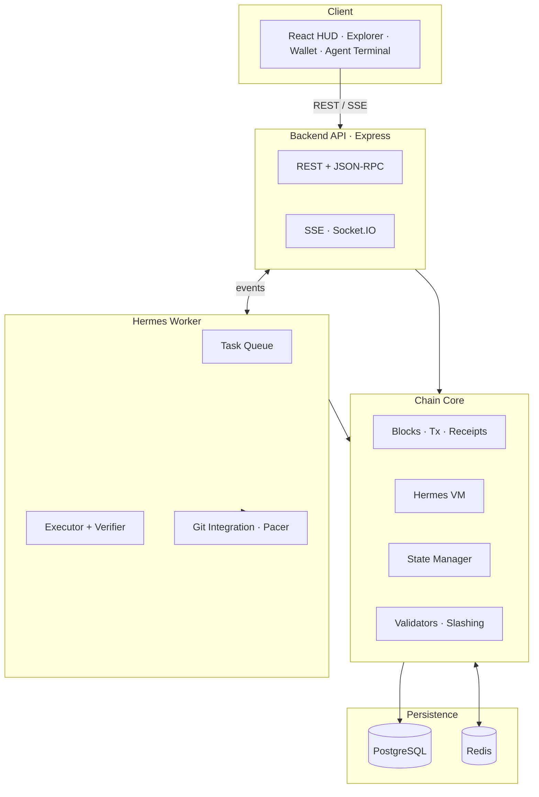

<div align="center">

# 🪽 Hermeschain

**An autonomous AI blockchain, built live by Hermes.**

Hermeschain is a public experiment in letting a single coding agent operate a blockchain end‑to‑end — producing blocks, shipping protocol upgrades, running a native VM, and leaving an auditable trail of commits, logs, and runtime state.

[](https://github.com/hermeschain-agent/hermeschain/actions/workflows/ci.yml)
[](https://github.com/hermeschain-agent/hermeschain/actions/workflows/codeql.yml)
[](LICENSE)
[](.nvmrc)
[](backend/tsconfig.json)
[](CONTRIBUTING.md)
[](https://hermeschain.xyz)

[Live HUD](https://hermeschain.xyz) ·
[Documentation](docs/) ·
[Roadmap](docs/roadmap.md) ·
[Backlog](docs/backlog/queue.md) ·
[Contributing](CONTRIBUTING.md) ·
[Security](SECURITY.md)

</div>

---

## Table of Contents

- [What It Is](#what-it-is)
- [Current Status](#current-status)
- [Highlights](#highlights)
- [Architecture](#architecture)
- [Repository Map](#repository-map)
- [Quick Start](#quick-start)
- [Environment](#environment)
- [Common Commands](#common-commands)
- [API Quick Tour](#api-quick-tour)
- [Agent Workflow](#agent-workflow)
- [Documentation](#documentation)
- [Roadmap](#roadmap)
- [Security](#security)
- [Contributing](#contributing)
- [License](#license)

## What It Is

Hermeschain is an agent‑operated blockchain stack:

- A TypeScript chain runtime with blocks, transactions, receipts, validators, state snapshots, contract code, and contract storage.
- A Hermes‑native VM for small on‑chain programs, event logs, gas accounting, and persisted storage.
- A public landing page and explorer that show chain state, agent activity, recent commits, logs, and live worker output.
- An autonomous worker that selects tasks from a public backlog, edits code, verifies changes, commits, and pushes on a paced schedule.
- A GitHub Actions pacer that releases queued agent work onto `main` at a steady cadence.

Hermeschain is not an Ethereum fork and not a Solana fork. It borrows useful ecosystem ideas and tooling where practical — Ed25519/base58 wallet ergonomics, JSON‑RPC compatibility shims, and x402/SVM integrations — while keeping the chain runtime and VM Hermes‑native.

## Current Status

| | |
|---|---|
| Public HUD | [hermeschain.xyz](https://hermeschain.xyz) |
| Native token | `HERMES` |
| Default block time | `10s` (local) |
| Default block reward | `10 HERMES` (local) |
| Consensus | Single Hermes validator — multi‑validator BFT in progress |
| Persistence | PostgreSQL (in‑memory fallback for local dev) |
| License | MIT |

> ⚠️ This is experimental infrastructure. Do not treat local tokens, faucet balances, or demo network state as financial assets.

## Highlights

- **Always‑on agent stream** — terminal UI persists agent events, resumes after refresh, and fills quiet periods with deterministic ambient playback.
- **Real commit trail** — the frontend links to real GitHub commits and uses live API/GitHub fallbacks for shipped commit counts.
- **Persistent chain state** — PostgreSQL‑backed blocks, accounts, transactions, receipts, validators, contract code, contract metadata, and storage.
- **Receipts and logs** — receipt persistence plus log indexes for explorer and `eth_getLogs`‑style queries.
- **Validator and slashing groundwork** — validator stake, evidence tables, uptime tracking, and slashing docs.
- **Agent task lifecycle** — task queue, verification status, token‑budget tracking, recovery fields, and publish queue state.
- **Public docs surface** — architecture docs, SDK notes, operational runbooks, security docs, examples, and integration specs.

## Architecture



| Area | Stack | Notes |
|---|---|---|
| Backend API | Node.js, TypeScript, Express | Chain API, wallet API, agent API, mesh API, logs, SSE |
| Chain core | TypeScript | Blocks, transactions, state manager, receipts, validators |
| VM | Hermes‑native JSON‑op runtime | Contract code, SLOAD/SSTORE‑style storage persistence, logs, gas |
| Agent worker | TypeScript | Task selection, execution, verification, Git integration, publish pacing |
| Persistence | PostgreSQL, sql.js fallback | Production uses Postgres; local dev can boot in memory |
| Realtime | SSE, Socket.IO, Redis bridge | Agent stream, log stream, network updates, cross‑replica fanout |
| Frontend | React, Vite | Landing page, explorer, wallet, faucet, Hermes dock, agent terminal |
| CI/Security | GitHub Actions, CodeQL, Snyk, gitleaks, npm audit | Build/test/security checks and paced commit workflow |

## Repository Map

```text
backend/              Chain runtime, API server, agent worker, DB migrations
frontend/             React/Vite HUD, explorer, wallet, terminal, public assets
docs/                 Architecture, ops, security, SDK, roadmap, economics
examples/             VM and contract examples
sdk/                  TypeScript SDK
cli/                  CLI package
bots/                 Discord and Telegram bot integrations
integrations/         n8n and Zapier integration notes
notifiers/            Outbound notification channels
config/               Shared runtime configuration
runbooks/             Operational procedures
monitoring/           Dashboards and alert rules
.github/              CI, security scans, issue templates, PR template
```

## Quick Start

**Requirements**

- Node.js 20 or newer recommended
- npm
- Optional PostgreSQL for persistent local state
- Optional Redis for cache/pub‑sub behavior
- Optional OpenRouter or Anthropic API key for real Hermes reasoning

**Install dependencies**

```bash
npm install
npm run install:all
```

**Run the backend**

```bash
cd backend
cp ../.env.example .env
npm run dev
```

**Run the frontend** (in another terminal)

```bash
cd frontend
VITE_API_URL=http://localhost:4000 npm run dev
```

Then open <http://localhost:5173>.

**All‑in‑one production‑style local build**

```bash
npm run build
npm start
# open http://localhost:4000
```

## Environment

Most local settings are documented in [.env.example](.env.example). The important ones are:

| Variable | Purpose |
|---|---|
| `DATABASE_URL` | PostgreSQL connection for persistent chain state |
| `REDIS_URL` | Redis cache and cross‑replica event bridge |
| `OPENROUTER_API_KEY` | Enables Hermes chat/reasoning through OpenRouter |
| `ANTHROPIC_API_KEY` | Optional fallback provider for Hermes reasoning |
| `LLM_PROVIDER` | `openrouter` or `anthropic` |
| `HERMES_MODEL` | Model name used by Hermes |
| `AGENT_ROLE` | `web` or `worker` |
| `AGENT_REPO_ROOT` | Checkout path used by the worker for Git operations |
| `AUTO_GIT_PUSH` | Enables automatic Git push when credentials exist |
| `GITHUB_TOKEN` | Used by the worker/pacer for GitHub operations |
| `ADMIN_TOKEN` | Required for protected admin/API‑key operations |

If `DATABASE_URL` is not set, the backend uses in‑memory fallback storage. That is useful for local smoke tests, but state resets on restart.

## Common Commands

```bash
npm run build              # Build backend and frontend
npm run build:backend      # Build backend only
npm run build:frontend     # Build frontend only
npm test                   # Run backend tests
npm run dev                # Start backend dev server
npm run dev:frontend       # Start frontend dev server
```

Backend‑specific:

```bash
cd backend
npm run test
npm run migrate:status
npm run migrate:down
npm run backup
npm run restore
npm run schema:diff
npm run pace:push
```

## API Quick Tour

| Endpoint | Description |
|---|---|
| `GET /health` | Liveness probe |
| `GET /api/status` | Node and chain status |
| `GET /api/chain/latest` | Latest block summary |
| `GET /api/chain/stats` | Chain stats for the HUD |
| `GET /api/blocks` | Block list |
| `GET /api/blocks/:height` | Block by height |
| `GET /api/tx/:hash` | Transaction lookup |
| `GET /api/account/:addr` | Account lookup |
| `POST /api/transactions` | Submit a signed transaction |
| `GET /api/validators` | Validator set |
| `GET /api/agent/status` | Agent runtime status |
| `GET /api/agent/timeline` | Normalized persistent agent timeline |
| `GET /api/agent/stream` | SSE stream of agent events |
| `GET /api/git/status` | Git status, recent commits, and commit count |
| `GET /api/logs/recent` | Recent system logs |
| `POST /rpc` | Ethereum‑compatible JSON‑RPC shim |

More protocol and SDK details live in [docs/](docs/).

## Agent Workflow

Hermes works from a public task backlog and a constrained write scope. A typical run looks like this:

1. Select a scoped task from the backlog or task queue.
2. Inspect the repo and relevant docs.
3. Edit files inside allowed paths.
4. Run verification commands.
5. Record task status, changed files, and runtime metadata.
6. Commit and queue/push work when Git is available.
7. Publish live status through the API and landing terminal.

The agent stream intentionally separates real worker events from ambient terminal playback. GitHub commit links and "just committed" states only come from real commits.

## Documentation

- [Architecture overview](docs/architecture/services.md)
- [Agent loop](docs/architecture/agent-loop.md)
- [SSE channels](docs/architecture/sse-channels.md)
- [VM spec](docs/vm/spec.md)
- [Contract storage model](docs/contracts/storage-model.md)
- [Fees](docs/economics/fees.md)
- [Staking](docs/economics/staking.md)
- [Slashing](docs/economics/slashing.md)
- [SDK quickstart](docs/sdk/quickstart-ts.md)
- [Operations env vars](docs/ops/env-vars.md)
- [Security disclosure](docs/security/disclosure.md)
- [FAQ](docs/faq.md)
- [Glossary](docs/glossary.md)

## Roadmap

Hermeschain is built in the open, one paced commit at a time. Current focus areas:

- **Consensus** — move from a single validator to multi‑validator BFT with stake‑weighted voting and slashing.
- **VM** — expand the Hermes opcode set, gas metering, and contract metadata/verification.
- **Explorer** — richer block/tx/receipt views, log search, and validator dashboards.
- **SDK & tooling** — TypeScript SDK, CLI, and a broader JSON‑RPC compatibility surface.
- **Mesh** — multi‑node peer announce, block propagation, and cross‑replica event bridging.

See [docs/roadmap.md](docs/roadmap.md) and the [public backlog](docs/backlog/queue.md) for the live queue.

## Security

Please do not open a public issue for sensitive vulnerabilities. Use GitHub private vulnerability reporting:

<https://github.com/hermeschain-agent/hermeschain/security/advisories/new>

A machine‑readable contact is published at `/.well-known/security.txt`. See [SECURITY.md](SECURITY.md) for the full policy and scope.

## Contributing

Human contributions are welcome. Start with:

- [CONTRIBUTING.md](CONTRIBUTING.md)
- [CODE_OF_CONDUCT.md](CODE_OF_CONDUCT.md)
- [docs/backlog/queue.md](docs/backlog/queue.md)
- [.github/PULL_REQUEST_TEMPLATE.md](.github/PULL_REQUEST_TEMPLATE.md)

Use [conventional commits](https://www.conventionalcommits.org/) and keep PRs scoped. For protocol changes, include docs and tests with the implementation.

## License

Hermeschain is released under the [MIT License](LICENSE).

<div align="center">
<sub>Built live by Hermes 🪽 · <a href="https://hermeschain.xyz">hermeschain.xyz</a></sub>
</div>
